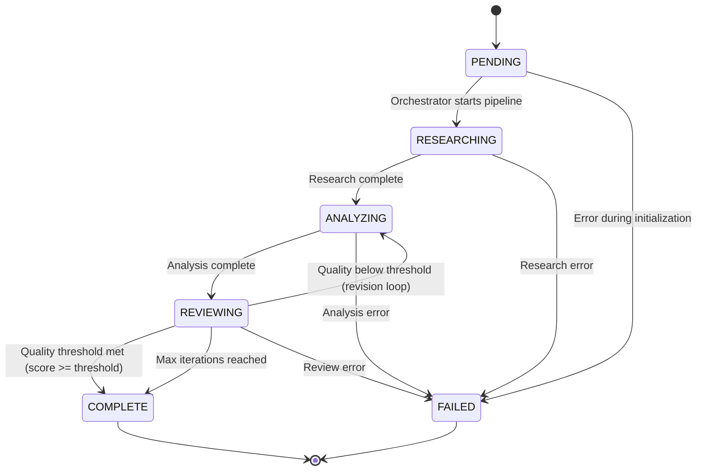

# Architecture

## Overview

The Agent Orchestrator implements a multi-agent pipeline using state machine coordination. Three specialized agents collaborate through a shared `TaskState` to process queries through research, analysis, and review phases.

## System Design

```
                    +-------------------+
                    |   Orchestrator    |
                    |   (coordinator)   |
                    +--------+----------+
                             |
              +--------------+--------------+
              |              |              |
     +--------v--+    +-----v------+   +---v--------+
     | Researcher |    | Analyzer   |   | Reviewer   |
     | (research) |    | (analyze)  |   | (review)   |
     +--------+--+    +-----^------+   +---+--------+
              |              |              |
              +--------------+--------------+
                             |
                    +--------v----------+
                    |    TaskState      |
                    | (shared state)    |
                    +-------------------+
```

## State Machine

The pipeline follows a directed graph with the following Mermaid state diagram:



### State Transitions

| From | To | Trigger |
|------|----|---------|
| PENDING | RESEARCHING | Orchestrator starts |
| RESEARCHING | ANALYZING | Research complete |
| ANALYZING | REVIEWING | Analysis complete |
| REVIEWING | COMPLETE | Quality threshold met |
| REVIEWING | ANALYZING | Quality below threshold |
| REVIEWING | COMPLETE | Max iterations reached |
| Any | FAILED | Error condition |

## Agent Design

### BaseAgent

All agents inherit from `BaseAgent` which provides:
- Role identification
- Mock/production mode switching
- Message passing helpers
- Consistent interface via `process(state) -> state`

### ResearchAgent

- **Input:** Query string
- **Output:** List of research findings
- **Mock:** Deterministic results based on query keywords
- **Production:** Would integrate web search APIs

### AnalyzerAgent

- **Input:** Research results
- **Output:** Structured analysis with key points and conclusion
- **Mock:** Template-based synthesis
- **Production:** Would use LLM for analysis

### ReviewerAgent

- **Input:** Analysis text
- **Output:** Review notes + approval/rejection
- **Checks:** Length, conclusion presence, structured points
- **Threshold:** Configurable approval score (default 0.6)

## Iteration Control

The reviewer can send work back to the analyzer for revision:

1. Analyzer produces analysis
2. Reviewer scores against quality checks
3. If score < threshold AND iterations < max: send back
4. If score >= threshold OR iterations >= max: approve

This creates a refinement loop that improves output quality while preventing infinite loops.

## API Layer

FastAPI provides REST endpoints:

- `GET /health` - Health check with version
- `POST /run` - Execute full pipeline
- `GET /graph` - Return graph structure

The API layer is thin - it creates an orchestrator and delegates to it.

## Mock vs Production

The system uses dependency injection via a `mock` flag:

```python
agent = ResearchAgent(mock=True)   # Deterministic mock
agent = ResearchAgent(mock=False)  # Production APIs
```

Mock mode enables:
- Testing without external dependencies
- Deterministic results for reproducible tests
- Demo mode for portfolio showcase
- Local development without API keys
